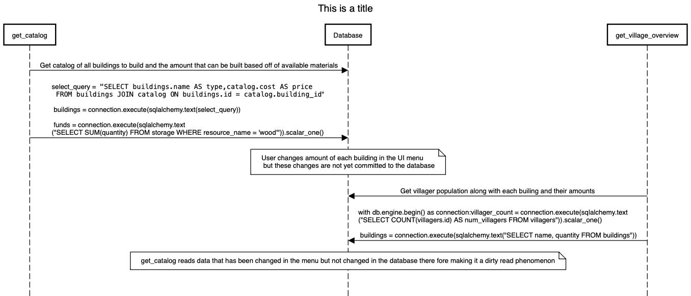
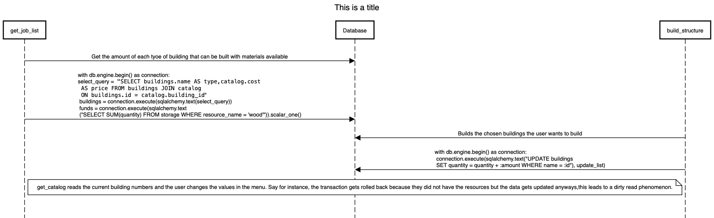
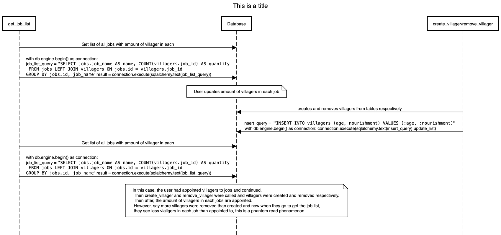

This diagram shows an example of a possible dirty read that may occur in our transactions if there were no concurrency controls in place. In this case, the get_catalog function is called and reads values from the database regarding amount of buildings and villagers. Then the user is able to update the building values in the UI menu from the game, however these changes will not be committed until the user continues. Then the user switches to the overview ta and calls get_overview function which will read the non-updated data regarding building numbers. We can avoid this issue by calling the get functions at the beginning of the menu to ensure all values read are at the same time and not stale, and having intermediary data structures store these general values to display to the user and update when needed so that the user does not see stale values and that values in the database will be updated uniformly and correctly from this structure.

This diagram shows an example of another possible dirty read that may occur in our transactions if there were no concurrency controls in place. In this case, get_catalog reads the current building numbers and the user changes the values in the menu. Say for instance, the transaction gets rolled back because they did not have the resources but the data gets updated anyways,this leads to a dirty read phenomenon. We can fix this case by not updating any table or data structure until after the transaction is confirmed to be valid or true.

This diagram shows an example of a phantom read that may occur in our transactions if there were no concurrency controls in place. In this case, the user had appointed villagers to jobs and continued. Then create_villager and remove_villager were called and villagers were created and removed respectively. Then after, the amount of villagers in each jobs are appointed. However, say more villagers were removed than created and now when they go to get the job list, they see less villagers in each job than appointed to, this is a phantom read phenomenon. We can fix this by ensuring that villagers assigned to a job do not fall below intended values in create/remove logic to ensure consistency between reads of get_job_list.